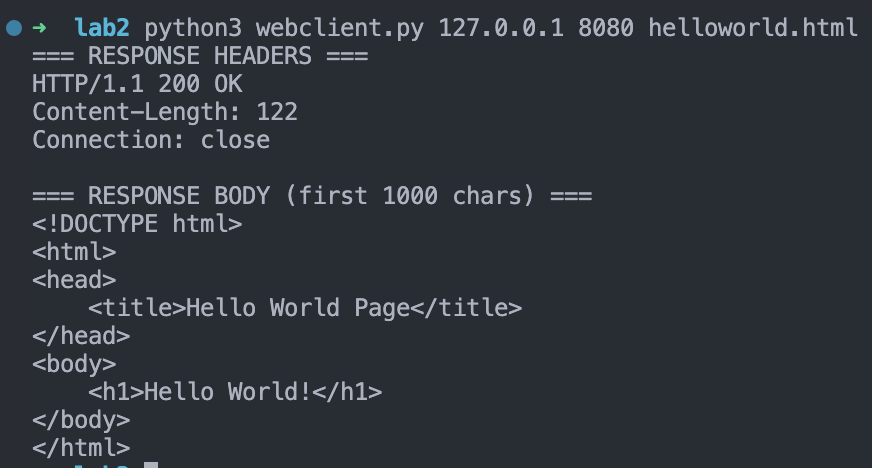

# Lab 2 – Web Server (Transport Layer)

**Course:** Computer Networks (Fall 2025)
**Student:** Hak Hyun Kim, Roya Parsa

---

## 1. Introduction

This lab focused on:

- Extending a **single-threaded web server** into a **multi-threaded web server**
- Handling **HTTP GET** requests and returning **404 Not Found** for missing files
- Serving **large files** such as `english_words.txt`
- Testing using a **custom Python client**, standard browsers, and `curl`

Key learning outcomes:

- Hands-on experience with **TCP socket programming**
- Understanding **HTTP/1.1 request–response** workflow
- Implementing **multi-threaded concurrency**
- Debugging and addressing **performance / security** issues

---

## 2. Design and Implementation

### 2.1 Architecture

- **Single-threaded (st_webserver.py):**Handles one client at a time in a loop. Useful as baseline for functionality testing.
- **Multi-threaded (mt_webserver.py):**Main thread accepts connections and spawns a **dedicated thread** for each client.Each thread:

  - Handles **GET** requests
  - Validates paths with `safe_path()`
  - Streams file contents in chunks with `Content-Length` and `Connection: close`
  - Returns **404 HTML** page for missing files
- **Security & Robustness:**

  - Rejects unsupported HTTP methods (405)
  - Prevents `../` directory traversal
  - Gracefully handles malformed requests

### 2.2 Source Files

- `st_webserver.py`
  - Baseline **single-threaded** version for functional correctness
- `mt_webserver.py`
  - Main multi-threaded server
  - `run_server()`, `handle_client()`, `safe_path()`, `build_header()`
- `webclient.py`
  - CLI-based HTTP client for testing
  - Sends GET request, loops to receive the entire response
  - Prints headers and body to terminal
- `helloworld.html`
  - Simple test page
- `english_words.txt`
  - Large text file for chunked-transfer testing

---

## 3. Results

### 3.1 Browser Tests

| Request                | Expected Result         | Observed |
| ---------------------- | ----------------------- | -------- |
| `/helloworld.html`   | 200 OK + HTML page      | ✔       |
| `/english_words.txt` | 200 OK + full long text | ✔       |
| `/nope.html`         | 404 Not Found           | ✔       |

`http://127.0.0.1:8080/helloworld.html`


`http://127.0.0.1:8080/english_words.txt`
`br`

`http://127.0.0.1:8080/nope.html`

### 3.2 Client Tests

Executed in terminal:

```bash
python3 webclient.py 127.0.0.1 8080 helloworld.html
python3 webclient.py 127.0.0.1 8080 english_words.txt
python3 webclient.py 127.0.0.1 8080 nope.html
```




### **3.3 Multi-Threaded Concurrency**

* Sent simultaneous requests (browser + **curl**)
* Server log showed **interleaved log lines**, confirming concurrent handling


### **3.4 Stability & Performance**

* Large file served completely without truncation or hanging
* **Content-Length** + **Connection: close** ensured client read until EOF
* 404 and 405 requests handled gracefully without server crash

---

## **4. Conclusion**

* Gained practical understanding of minimal HTTP server over TCP
* Observed limitations of single-threaded blocking design
* Demonstrated concurrency benefits of multi-threaded architecture
* Developed debugging and testing skills for networked applications
* Future work: add TLS, thread-pool, caching, MIME handling, and logging
